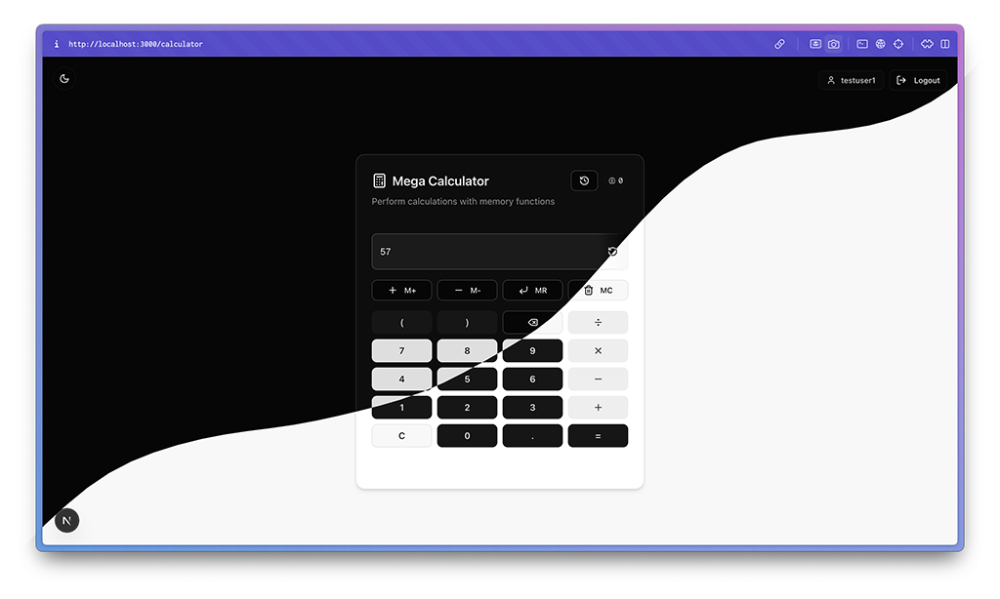
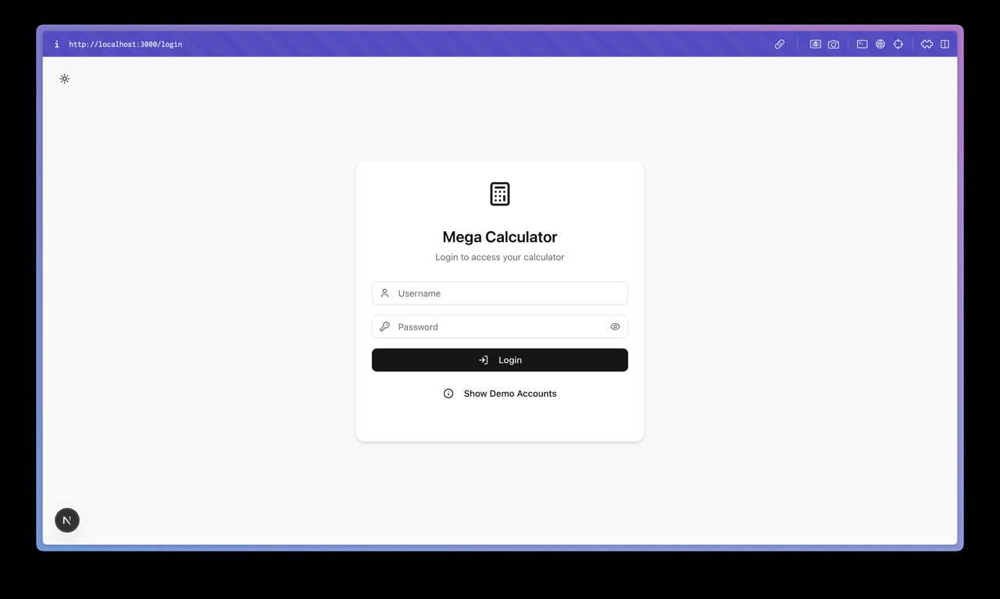
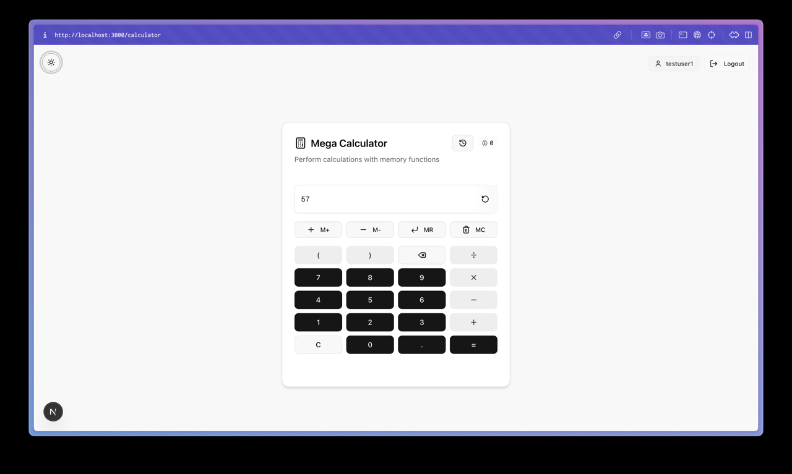
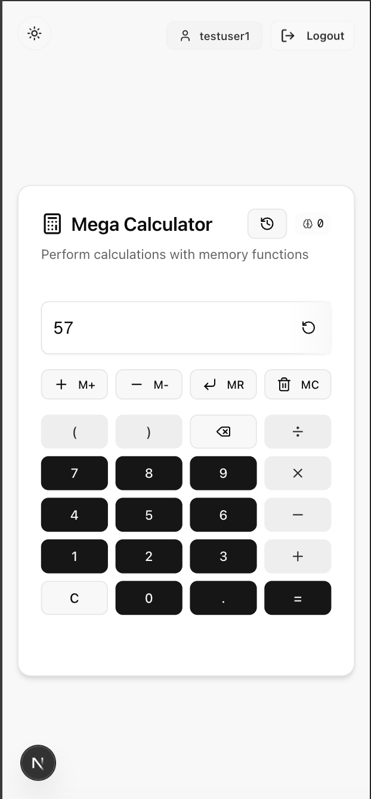
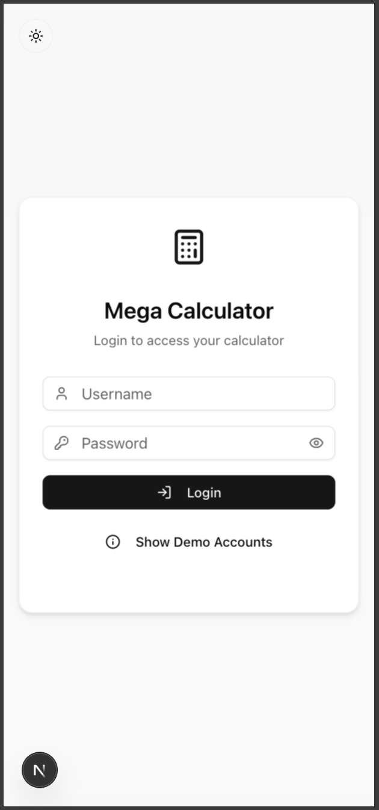
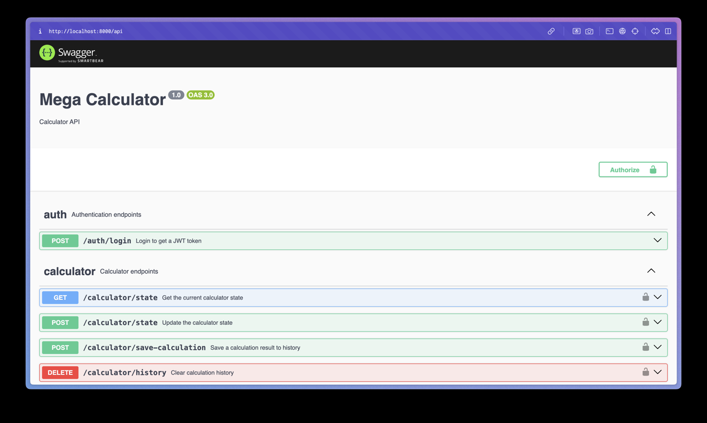

# MEGA Calculator

Онлайн калькулятор с сохранением истории вычислений, работой с памятью и персональными аккаунтами.

## Демонстрация

### Веб-версия
<div align="center">
  
  
</div>

### Мобильная версия
<div align="center">
  
  
</div>

### API Документация


## Функциональность

- Математические расчеты с поддержкой различных операций
- Сохранение истории вычислений
- Функции памяти калькулятора (сохранение, вызов, сложение, вычитание)
- Регистрация и авторизация пользователей
- Поддержка светлой и темной темы
- Адаптивный дизайн для мобильных устройств

## Технологии

### Frontend
- Next.js
- React
- TypeScript
- Tailwind CSS
- Framer Motion (анимации)
- Zustand (управление состоянием)

### Backend
- NestJS
- MongoDB
- JWT-авторизация
- Swagger API-документация

## Запуск

Проект можно запустить с помощью Docker Compose:

```bash
docker-compose up -d
```

Приложение будет доступно по адресу [http://localhost:3000](http://localhost:3000)

Swagger API доступно по адресу [http://localhost:8000/api](http://localhost:8000/api)

## Разработка

### Frontend

```bash
cd frontend
npm install
npm run dev
```

### Backend

```bash
cd backend
npm install
npm run start:dev
```

## API

API документация доступна по адресу [http://localhost:8000/api](http://localhost:8000/api) после запуска бэкенда. 